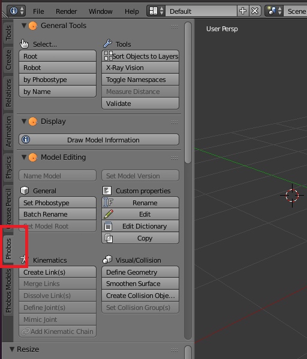
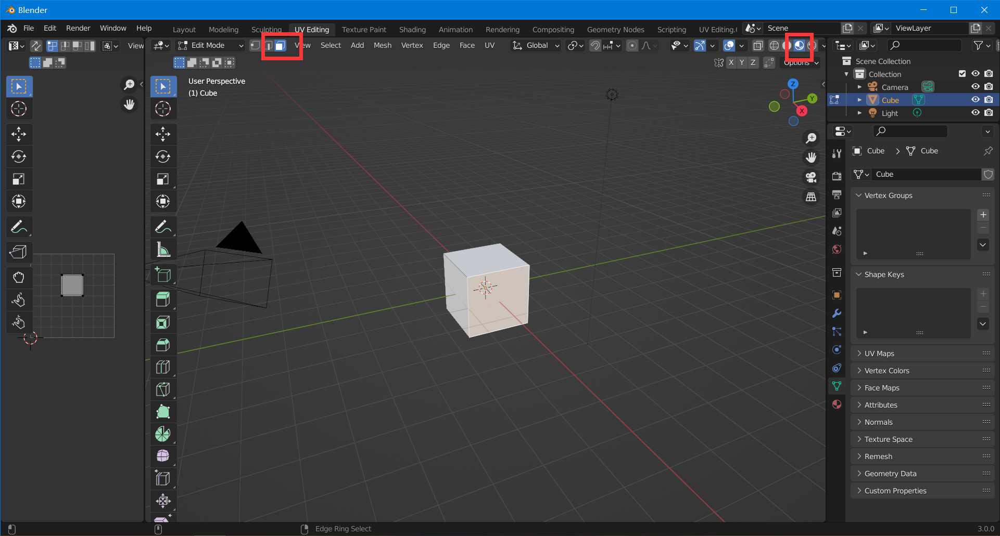
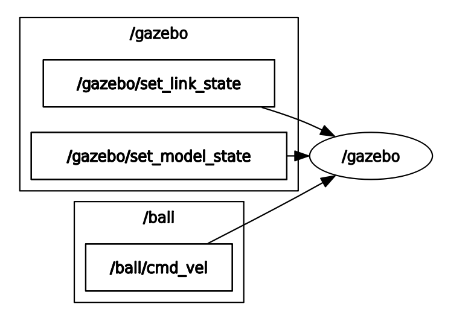

# Gazebo 模型简明教程

写于 2022 年 5 月

注：该教程为 Gazebo Classic 的教程，新版本的 Gazebo (原名 Ignition) 只有部分参考价值

## Part I 前言

90%的Gazebo模型教程从类似这样的命令行指令开始：

`gazebo worlds/pioneer2dx.world` <a href="https://classic.gazebosim.org/tutorials" target="_blank"> Gazebo 官方教程 </a>

或是类似这样的：

`roslaunch my_simulations my_world.launch` <a href="https://www.theconstructsim.com/category/gazebo-tutorials/" target="_blank"> Construct 的 《五分钟Gazebo》 系列教程 </a>

上面这些命令是将一些现成的模型文件刷进Gazebo，作为新手的导入并无不妥，但是所有这些教程都没有回答一个至关重要的问题：**模型要从哪里来**。

你确实可以从许多网站上找到出自专业人士之手的3D模型，如果你运气好，你甚至可以找到你需要的 URDF（模型）文件，但是你需要的只是一个简单的，用于演示的样例模型呢？这些教程无一例外地忽视了这个问题，这也是我写这个教程的初衷，**如何搭建/修改一个你需要的 Gazebo 场景**。

本文的目标读者如下：
- 知道 ROS topic 是什么，会用 `rosrun`, `roslaunch`，能依葫芦画瓢写简单的 `roslaunch` 文件
- 不以建模为最终目的，即，模型是你用于一个更大目标的一部分（这不是一个建模教程！）
- 死线逐渐逼近，你需要一个仿真演示来交差，但是你找不到现成的 URDF
- 你已经有了一个别人做的 URDF/XACRO ，但是不知道怎么修改它

本文所涵盖的内容如下：
- Gazebo 需要什么格式的模型
- 如何将 URDF 导入 Gazebo
- 如何制作简单的 URDF
- 如何将 URDF 设为不动的，透明的，没有碰撞体积的，不受重力影响的
- 如何使用 CAD 软件生成 URDF (Solidworks 或 Blender)
- 如何制作更精细的 URDF (mesh 网格文件)
- 如何制作有贴图的 URDF (texture 纹理 和 material 材质)
- 如何改变 URDF 在 Gazebo 中的速度和位置 (Gazebo Plugin)
- 如何在 Gazebo 中转动 URDF 的关节 (ROS Moveit!)
- 如何制作仿真相机或仿真传感器 (Gazebo Plugin)

## Part II 正文

#### Gazebo 需要什么格式的模型

Gazebo 需要两种模型: 描述文件 (description file) 和网格文件 (mesh file)

第一种描述了机器人各个部件之间的连接关系，被称为描述文件 (description file)。这是一类 Gazebo 专用的文件，常见的格式有：<br>

**URDF**： 你会需要经常手写/手改这种文件<br>
**SDF**： 你不需要对它有任何了解，注意 `.world` 格式内的模型也是用这种格式进行描述的<br>
**XACRO**： URDF，但是可以内嵌代码让描述文件更加精简、可读。<br>
**.world**：许多个模型的描述文件用 SDF 格式打包成一个描述文件。*没有人手写这种格式，大家都是在布置完场景之后 Gazebo -> File -> Save World，这样直接导入 world 就不需要重新布置一遍。* <br>
**.gazebo**: 有时候你会看见以 `.gazebo` 结尾的文件，这些文件本质也是 URDF ，它们中的内容其实可以写在 URDF 文件中，但是为了让文件结构更加清晰而被单独分出来。全部视为 URDF 就好。
<br>
<br>
<br>
Gazebo 需要的另一种模型描述了被连接的部件的形状，被称为网格文件 (Mesh file).由于我们之前提到的 description file 也具有基本的描述形状的功能，Mesh file并不是必要的。Mesh file 其实就是一般的 3D 建模软件的文件。 Gazebo 接受 **DAE，STL，OBJ** 三种格式，这些格式可以被绝大多数市面上常用的 3D 建模软件 (Solidworks, Blender, 等等) 导入和导出。

使用 Mesh file 时，将 Mesh file 文件的路径嵌入 description file，例如：
```
...URDF 的其他部分...
<visual name="Cube">
  <origin xyz="0 0 0" rpy="0 0 0"/>
  <geometry>
    <mesh filename="package://my_ros_package/meshes/dae/box.dae" scale="0.019 0.019 0.019"/>
  </geometry>
</visual>
...URDF 的其他部分...
```
这里就将在 `my_ros_package` ROS 包目录下（使用绝对路径也是可以的）的 `box.dae` 嵌入了某个 link 的 visual 部分，这样显示时这个 link 就会显示为 `box.dae` 的样子。

>*！如果在此处使用相对路径，可能会触发一个模型隐形的 bug，详见 <a href="#bug" target="_blank">常见_BUG_修复</a>*.

<br>

所有的材质与贴图，也都推荐借助 Mesh file 来实现，详见 <a href="#texture" target="_blank">如何制作有贴图的 URDF texture 纹理 和 material 材质</a>

#### 如何将 URDF 导入 Gazebo
将 URDF 导入 Gazebo 主要有两种方法：

我们首先介绍相对便于 debug 的一种导入方法：命令行

在第一个 terminal 中：
```
rosrun gazebo_ros gazebo
```
在第二个 terminal 中：
```
rosrun gazebo_ros spawn_model -urdf -file <directory_to_your_URDF_file> -model <name_of_your_URDF_model>
```

- 如果目标文件是 sdf，则将 `-urdf` 换成 `-sdf`
- 可以在末尾添加 `-x 0.0 -y 0.0 -z 0.0` 来控制导入Gazebo时的初始坐标

>*！此时极易发生模型隐形bug，见<a href="#bug" target="_blank">常见_BUG_修复</a>*

第二种方法在各种 Gazebo 教程中较为流行：将模型的导入编成 roslaunch 文件，然后使用 `roslaunch` 命令导入。

一个极简的例子如下：
```
<?xml version="1.0"?>
  <launch>
    <node name="myBox_urdf_spawner" pkg="gazebo_ros" type="spawn_model"
	   respawn="false" output="screen"
	   args="-urdf -file $(find my_ros_package)/urdf/box.urdf -model <name_of_the_model> -x 0.0 -y 0.0 -z 0.0"/>
</launch>
```
*其中 \<name_of_the_model\> 是你希望该 URDF 模型在 Gazebo 中显示的名称，可以随意填写，一般与模型名称一致*
>*！这里file后的路径也可以换成相对路径，但是如果这样做，也极易发生模型隐形bug，见<a href="#bug" target="_blank">常见_BUG_修复</a>*

#### 如何制作简单的 URDF

手写 URDF 的一般方法是复制一个别人的 URDF，然后进行一些手动的删改。如何手写一个简单的 URDF, 我认为学习 <a href="http://wiki.ros.org/urdf/Tutorials" target="_blank"> ROS URDF 官方教程 </a> 中的 *2. Learning URDF Step by Step* 即可。可以只学习下列三个小节：
- 2.1 <a href="http://wiki.ros.org/urdf/Tutorials/Building%20a%20Visual%20Robot%20Model%20with%20URDF%20from%20Scratch" target="_blank"> Building a Visual Robot Model with URDF from Scratch </a>
- 2.2 <a href="http://wiki.ros.org/urdf/Tutorials/Building%20a%20Movable%20Robot%20Model%20with%20URDF" target="_blank"> Building a Movable Robot Model with URDF </a>
- 2.3 <a href="http://wiki.ros.org/urdf/Tutorials/Adding%20Physical%20and%20Collision%20Properties%20to%20a%20URDF%20Model" target="_blank"> Adding Physical and Collision Properties to a URDF Model </a>


一个常见的 URDF 模型由下列几个标签组成（除了\<robot>）:
- \<link>
- \<joint>
- \<gazebo>
- \<sensor>
- \<transmission>

如果完成了上述的教程，你应该对 link 和 joint 已经相当熟悉了，它们定义了 URDF 模型的各个零件和零件之间的连接方法。

> 注意：Gazebo会把所有用 fixed joint 连接的 link 视为同一个 link

###### \<gazebo>

gazebo 标签定义了模型在 Gazebo 中的一些设置，比如受重力影响，是否启用自碰撞，摩檫系数等等。

gazebo 标签同时定义了 gazebo plugin, 所有的控制器和传感器，都需要定义在 gazebo 标签下。

###### \<sensor>:

URDF 自带的传感器可以使用 sensor 标签来定义，比如单目摄像头等。sensor 标签也需要定义在 gazebo 标签下。

###### \<transmission>:

只有需要控制 joint 的运动时，才需要定义 transmission 标签。transmission 标签定义了 joint 运动时的控制器类型 (controller).

#### 如何将 URDF 设为不动的，透明的，没有碰撞体积的，不受重力影响的

**将 URDF 设置为不动的**（任何碰撞无法改变它的位置）有两种方法：

第一种方法是在 URDF 中定义一个叫 `world` 的 link，然后在需要设置为不动的 link 与 world link 之间定义一个 fixed joint 即可。
```
<link name="world"/>
    <joint name="fixed" type="fixed">
      <origin xyz="0 0 0" rpy="0 0 0"/>
      <parent link="world"/>
      <child link="target_link"/>
    </joint>
```
也可以在 world 与 link 之间定义其他类型的 joint 来获得只有一个或几个自由度的模型（但是不推荐这么做，有专门控制运动的 Gazebo plugin）

第二种方法是在 URDF 的 model 标签下定义一个 static 标签
```
<model name='robot'>
  <link name='link_name'>
    ...
  </link>
  <static>1</static>
</model>
```
**将 URDF 设置为透明的或没有碰撞体积的**，只需要在对应的 link 中不定义 \<visual> 和 \<collision> 即可，例如：

```
<!-- 正常的 link -->
<link name='link1'>
  <visual> ... </visual>
  <collision> ... </collision>
</link>

<!-- 透明的 link -->
<link name='link2'>
  <collision> ... </collision>
</link>

<!-- 没有碰撞体积的 link -->
<link name='link3'>
  <visual> ... </visual>
</link>
```
**将 URDF 设为不受重力影响的**

```
<!-- ROS noetic / Gazebo 11 -->
<gazebo reference="ball_link">
  <gravity>0</gravity>
</gazebo>

<!-- ROS melodic / Gazebo 9 -->
<gazebo reference="ball_link">
   <turnGravityOff>true</turnGravityOff>
</gazebo>

```
#### 如何使用 CAD 软件生成 URDF (Solidworks 或 Blender)

主流的 CAD 软件不少都有第三方的 URDF 导出插件：

Solidworks 的插件是 <a href="http://wiki.ros.org/sw_urdf_exporter" target="_blank"> sw_urdf_exporter </a>, 可以在这里访问他们的 github 来下载对应 SW 版本的插件: https://github.com/ros/solidworks_urdf_exporter。

sw_urdf_exporter 的教程：http://wiki.ros.org/sw_urdf_exporter/Tutorials

我比较常用的是 Blender 的插件 <a href="https://github.com/dfki-ric/phobos" target="_blank"> phobos </a>

<a href="https://www.blender.org/" target="_blank"> Blender </a> 是一个免费开源的 3D 建模软件，大小只有不到 400MB，却功能齐全，且有非常强大的社区第三方插件支持，因此也是我最喜欢的 3D 建模软件（开源万岁）。因为不是所有的你不想购买付费的建模软件，又不希望使用盗版，可以考虑使用它。我们接下来的教程都将以 Blender 为例。

由于 Blender 于 2021 年 12 月发行了新的大版本更新 3.0，告别了使用了十余年的 2 字头版本，phobos 截至目前 (2022.5) 只保证能在 2.8 与 2.9 上稳定运行，建议同时安装 Blender 的 2.93 LTS 与 最新版本。（我同时安装了 2.79b 与 3.0.0）

Phobos 的教程见此处：https://github.com/dfki-ric/phobos/wiki

不过这个教程写得过于繁杂，下面是我自己写的教程 (使用Blender 2.79b 与 Phobos 1.0.1)

跳到下一章：<a href="#mesh" target="_blank">如何制作更精细的 URDF (mesh 网格文件)</a>

首先依照 Phobos 的指南在 Blender 中安装插件。每一次启动Blender时，要使用 Phobos, 都需要先在 User Preference 中启动 Phobos 插件 (新版本的 User Preference 被移动到了 Edit 分栏下)


这时你应该能在主界面上找到 Phobos 的操作界面



首先在 Blender 中建/导入一个你想做成 URDF 的模型。

在这一章我们只使用 URDF 中自带的形状（长方体，球体，和圆柱体）来构建我们的 URDF。对于在 URDF 中使用更复杂的模型，可以参考下一章 <a href="#mesh" target="_blank">如何制作更精细的 URDF (mesh 网格文件)</a>，如果希望在 URDF 中使用贴图，可以参考下下一章 <a href="#texture" target="_blank">如何制作有贴图的 URDF (texture 纹理 和 material 材质)</a>。


接下来我们开始将模型变成 URDF, 首先我们来定义 `<visual>` 部分

选中模型的每一个零件，依次 `Set Phobostype` 并将类型设置为 `Visual`


选中模型的每一个零件，依次 `Define Geometry` 并将类型设置为对应的类型，如果不是长方体，球体，或圆柱体，则选择 `mesh`


然后我们来定义零件 (link) 之间的父子关系。对于一对需要设置父子的零件，**首先选中作为“子”的零件，然后选中作为“父”的零件**，`Ctrl-P` 后 `Set Parent To Object`. 直到定义完所有零件。

> URDF 所有的 link 之间的关系之和必须是树，不能成环


接下来我们定义 link, 选中模型的每一个零件，依次 `Create Link(s)`。注意下面的 `Location` 选项，推荐选择 `selected objects`.


这时每一个零件都应该有一个对应的 link 了。**首先选中零件，然后选中刚刚我们 create 的 link**，`Ctrl-P` 后 `Set Parent To Bone Relative`. 直到定义完所有零件。(`Z` 键可以切换成线框视图，便于选中零件内部的link，link是图中的八面体)。


现在定义 link 之间的父子关系。**首先选中作为“子”的 link，然后选中作为“父”的 link**，`Ctrl-P` 后 `Set Parent To Bone Relative`. 直到定义完所有 link.


现在 Blender 的右上角的零件总览应该看起来像这样


改一下名便于日后维护。在最后生成的 URDF 中，bone（大字人形）的名字会作为 link 的名字，mesh （倒三角） 的名字会作为 \<visual\> 的名字 （visual 有没有名字都不会导致 URDF 出错，所以一般手写时无需命名）。


选中一对 link （不是零件），`Define Joint`. 不同的 Joint 会让 link 从八边形变成各种形状。


注意如果定义了 `revolute` 等有上下限的 joint, 必须设置非0的上下限，否则导出时会自动转换为 `fixed` 类型的 joint.


接下来定义零件的碰撞箱，选中模型的每一个零件，依次 `Create Collision Object(s)`.


现在 Blender 的右上角的零件总览应该看起来像这样。新添加的 mesh （倒三角） 的名字会作为 \<collision\> 的名字 （和 visual 一样，collision 有没有名字也都不会导致 URDF 出错，所以一般手写时也无需命名）。


这时选中那唯一一个没有 parent link 的 link (base link)，用 `Set Model Root` 将它设置为 root link.


`Name Model` 为模型命名，命名结束后 root link 会变成扳手形状。


接下来我们导出零件，按两下 `A` 可以将所有模型全不选。点击取消 `Selected only`，否则会只导出选中部分的模型。

>场景中的灯光和摄像机会被自动忽略，因此不必担心这些也被导出


依次设置后 `Export Model` 导出模型。这个模型没有 Meshes 需要导出所以可以不选 `dae`，如果有则推荐使用 dae 格式导出。


此时应当会在导出路径看到两个（或一个，如果没有导出 Mesh）文件夹


最后需要对 URDF 进行一些手动修改，生成的 URDF joint 的名字会默认和 link 一样，这会让 Gazebo 报错。把 joint 改成别的名字（比如 _joint 后缀）。

已修改（上） 未修改（下）


依照第二章所述，将 URDF 刷进 Gazebo.

> 如果遇到 BUG, 记得参考文后的<a href="#bug" target="_blank">常见_BUG_修复</a>


#### <a id="mesh">如何制作更精细的 URDF (mesh 网格文件)</a>

>**首先你需要分清你需要的是更精细的模型还是贴图！**<br>
如果你需要：<br>
交通标志<br>
AprilTag<br>
之类只需要让视觉模块 / 人类能在仿真中认出的模型，请一定一定先考虑贴图 (texture).<br>
如果在应该用贴图的地方错误地使用了精度更高的模型, 会**大大地降低性能和视觉模块在仿真中的准确度**，并浪费大量建模的时间和精力<br>
如果你需要的是贴图，请参见下一章<a href="#texture" target="_blank">如何制作有贴图的 URDF texture 纹理 和 material 材质</a>

使用 Phobos `Define Geometry` 时，将类型选择为 `mesh`，导出的 URDF 即可链接到一个网格文件 mesh file.

第一步还是用 Blender 搭建一个模型，Blender 的教学已经很多了。

虽然我们可以将这个模型拆成三个叠放的 Cylinder 在 URDF 中表示，但是为了演示在 Gazebo 中使用 Mesh, 我们假装我们必须要一整个导入进去。


其他的步骤和上一章完全一样，除了 `Define Geometry` 时，需要将类型选择为 `mesh`


填加完 Collision, 它看起来是这样的。为了优化性能，我们将它的 Collision 设置为 URDF 自带的 Cylinder.

这是 Visual


这是 Collision


最后按第二章所属导入 Gazebo.

>*！Phobos 生成的 URDF 引用 Mesh 使用的是相对路径，使用方法不对极有可能触发模型隐形的 bug，详见 <a href="#bug" target="_blank">常见_BUG_修复</a>*.


#### <a id="texture">如何制作有贴图的 URDF (texture 纹理 和 material 材质)</a>

这一章我们将如何使用 Blender 导出有贴图的 Mesh file. 贴图是 Blender 中相对庞大的一个分支，有时很难找到需要的那一个教学。在此将 Blender 填加贴图的常用方法简单总结，以一个立方体上贴 AprilTag 为例。


*使用 Blender 版本: 3.0.0，虽然新点旧点其实无所谓，但是我在用 2.79b 导出 DAE 的时候有遇到过模型隐形，导出 3.0.0 再导出就没问题的情况，所以还是尽可能用新的版本吧。*

进行贴图需要两个条件：其一是用来贴的图（普通的图片格式，png, jpg 等等）。将一张 2D 的图贴在一个 3D 的模型上，需要首先把 3D 模型尽可能展成平面。但是我们发现，同样的一张图贴给一个立方体，我们可能有很多展开的方法，也有很多的贴法：六个面都一样，只贴一个面其他留白等等。标明怎么展开，怎么贴 2D 图片的过程就被称为 UV mapping，这也就贴图所需的第二个条件。

所有 Blender 中的贴图都是以材质 (Material) 形式表现的，我们首先创建一个新材质：


贴图一定是材质，但材质不一定是贴图。我们需要把材质设置成贴图，打开 `Shading` 分栏，这里可以设置这个材质的着色方法。


这是 Blender 的节点着色器，打开时会自带 `Principled BSDF` 和 `Material Output` 两个节点。我们按下 `Shift + A` 打开新建节点界面，点击 `Search` 搜索添加 `Image Texture` 节点。


在 `Image Texture` 节点中选择你需要的贴图（任意格式的图片基本都可以），然后将 `Image Texture` 的 `Color` 接口连接到 `Principled BSDF` 的 `Base Color` 接口上。

至此，我们选好了要贴的图片，接下来我们开始定义怎么贴。


打开 `UV Editing` 分栏，确认当前在 `Edit Mode` 模式，按 `U` 可以对模型进行 UV Mapping （展开成 2D）。一般我们会直接选择 `unwrap`, 但是立方体有专门的展开方法，我们选择 `Cube Projection`.

> 只会展开选中的部分，确认一下是否全部选中了


UV Mapping 之后，确认两件事：

在模型一侧，确认左上的选择方法是 `Face Select`, 右上的 `Viewport Shading` 选择的是 `Material Preview` 模式。



在 UV Editor 一侧，确认左上的 UV 选择方法是 `Face Selection Mode`, 右上的贴图图片选择已经选中了你想要贴的图，你应该会看到图片出现在 UV Editor 里。

点选右侧我们在上一步创建的使用 `Image Texture` 的模型，选中模型的若干个面，点击 `Assign`.


这样贴图就被映射到了你选择的面上。


选中模型的若干个面，`Assign` 默认的材质 (Material)，这样就可以得到只贴了一部分面的模型。


在左侧 UV Editor 里选中一些方框，按 `G` 可以移动，按 `S` 可以放缩，所有快捷键和操作模型的快捷键都是一致的。

现在可以 `File -> Export` 来导出了。

贴图 (texture) 永远是独立于 mesh file 存在的一张图片，我们在 *Gazebo 需要什么格式的模型* 中讲过，Gazebo 支持三种格式的 mesh file: **DAE，STL，OBJ**, 事实上，每一种格式对贴图的图片文件都有不同的处理方法。

DAE （守序善良） - 导出时会在同一目录下导出贴图文件，dae 使用相对路径引用贴图图片，只要贴图和 DAE 在同一个目录下，贴图就不会失效


OBJ （绝对中立） - 导出时生成 UV 文件（怎么贴） 和 Mesh 文件（没有材质的3D）。直接由Blender 生成的 UV 文件使用绝对路径来引用贴图图片，如果贴图图片的路径改变，则无法加载贴图。可以手动编辑修改为相对路径。


STL（混乱邪恶） - STL 完全不支持贴图，从根本上解决了问题。


现在你应该明白为什么 **DAE** 是 Gazebo 推荐使用的格式了。

**额外问题：模型的放缩**

放大模型时已经应用的贴图会跟着被拉伸，但是如果我希望模型不变型呢？


`Object -> Apply -> Scale` 来应用变形


进入 `Edit Mode` 按 `U` 重新 UV Mapping


即可，如果不希望贴图在未定义的地方重复，可以在 `Shading` 分栏中找到 `Image Texture` 节点调整设置。


#### 如何控制 URDF 在 Gazebo 中的速度和位置 (Gazebo Plugin)

要控制一个在 Gazebo 中的URDF，我们需要使用 Gazebo Plugin，我们用一个球来举例：

```
<?xml version="1.0"?>
<robot name="ball">
  <link name="ball_link">=
    ... <!-- content of the link -->
  </link>

  <gazebo>
   <plugin name="object_controller" filename="libgazebo_ros_planar_move.so">
     <commandTopic>/ball/cmd_vel</commandTopic>
     <odometryTopic>odom</odometryTopic>
     <odometryFrame>odom</odometryFrame>
     <odometryRate>20.0</odometryRate>
     <robotBaseFrame>ball_link</robotBaseFrame>
   </plugin>
 </gazebo>

</robot>
```

定义在 `<plugin>` 标签中的就是 Gazebo Plugin 了。Gazebo 自带了许多插件，这里是官方的教程： https://classic.gazebosim.org/tutorials?tut=ros_gzplugins 写的已经非常详细了，因此我们只拿（我个人最常用的） planar move 插件进行举例。

将球刷进 Gazebo 中，使用
```
rqt_graph
```
可以看到所有节点的连接情况



此时向 `ball/cmd_vel` 发送指令就可以控制球的速度。

使用命令行控制的方法如下，注意输入 topic name 之后所有的内容都可以按 `Tab` 进行自动补全:

```
rostopic pub /ball/cmd_vel geometry_msgs/Twist "linear:
  x: 0.0
  y: 0.0
  z: 0.0
angular:
  x: 0.0
  y: 0.0
  z: 0.0"
```

如果希望使用代码进行控制，简单包装即可

需要注意：施加速度的坐标系是模型的坐标系，在球体上使用这个插件的时候，球会因为和地面的摩擦而滚动，模型坐标系的指向可能会发生变化，会让球以奇怪的方式运动。在 Gazebo 中切换到移动模型模式并点击模型即可查看其模型坐标系的指向。

我个人的解决方案是禁用球的重力并将球刷新在空中。

**控制模型的位置，需要使用 Gazebo 提供的 rosservice `/gazebo/set_model_state` 这个 service 就是真正无视物理法则的位移了。**

#### 如何在 Gazebo 中转动 URDF 的关节 (ROS Moveit!)

如果你有了一个定义了 link 和 joint 的 URDF 文件，现在希望用代码来控制关节的转动，首先你需要为要控制的关节绑定 `<transmission>`.

```
<transmission name="tran1">
  <type>transmission_interface/SimpleTransmission</type>
  <joint name="turret_yaw_joint">
    <hardwareInterface>hardware_interface/PositionJointInterface</hardwareInterface>
  </joint>
  <actuator name="turret_yaw_motor">
    <hardwareInterface>hardware_interface/PositionJointInterface</hardwareInterface>
    <mechanicalReduction>1</mechanicalReduction>
  </actuator>
</transmission>
```
其中 joint name 需要和你希望绑定的关节的名字一致，actuator 和 transmission 的名字可以随便起。

注意 `<hardwareInterface>`，这个标签非常关键。里面的内容在 ROS noetic 版本中最常用的有两种选择: <br>
`hardware_interface/PositionJointInterface`<br>
`hardware_interface/EffortJointInterface`

**如果你确定你的模型不需要推/拉/抓举任何东西，选择 `PositionJointInterface`, 这可以让你省去调 PID 的步骤。**

**反之，如果你的模型需要与任何物体进行力的交互（单纯地在地面上推、拉不算），则一定要选择 `EffortJointInterface`, 否则你的模型在仿真中将无法提供任何的力。**

>如果在 spawn_model 时提示没有某个 hardwareInterface，这些 hardwareInterface 是可以用和所有 ROS package 一样的方法安装的。

完成上述定义 `<transmission>` 的定义之后，参考官方教程，使用 Moveit 的

```
roslaunch moveit_setup_assistant setup_assistant.launch
```

来进行模型的设置。可以参考 Moveit 的官方教程： https://ros-planning.github.io/moveit_tutorials/doc/setup_assistant/setup_assistant_tutorial.html

设置完成后，使用

```
roslaunch <你导出的文件夹> demo_gazebo.launch
```
即可开始控制。

Moveit 也提供了
https://ros-planning.github.io/moveit_tutorials/doc/gazebo_simulation/gazebo_simulation.html 这个教程来帮助用户学习 Gazebo 和 Moveit 相结合，如果上面的直接运行有问题，可以看这一章。

要使用 Python / CPP 代码进行控制，可以参考 Moveit 的另一个官方教程：https://ros-planning.github.io/moveit_tutorials/doc/move_group_python_interface/move_group_python_interface_tutorial.html


#### 如何制作仿真相机或仿真传感器 (Gazebo Plugin)

https://classic.gazebosim.org/tutorials?tut=ros_gzplugins

力传感，相机，等等一干传感器均见此教程

#### 未来可能的更多内容

- 如何抓举：以 Universal Robot 为例
- 如何在 Gazebo 中使用人物模型


#### <a id="bug">常见 BUG 修复</a>

###### 1. process has died
Gazebo 不允许多开，所以有时候会莫名其妙地报这个错：

```
[gazebo-1] process has died [pid xxxxx, exit code 255
```
这可能是后台上一次开启的 Gazebo 没有完全关闭，这个时候

```
killall gzclient
killall gzserver
```
来彻底关闭 Gazebo 即可。

###### 2. 模型隐形

首先可以启动显示碰撞来确定模型是没有刷进来还是模型隐形。


如果只能看见模型的碰撞箱，不能看见模型的 mesh，则是模型隐形，有两种可能的解决方法。

**第一，如果在 URDF 中 mesh 文件使用的是相对路径，而非 ROS 包的名字：注意，这个相对路径是以启动 `rosrun gazebo_ros gazebo` 的路径作为起点！**

比如说<br>
/model<br>
|-/mesh<br>
|-/urdf<br>
这样的文件结构，假设有 `/urdf` 中的某 URDF 使用 `../mesh/a.dae` 来表示其 mesh 文件的路径。如果我们在 `/model` 中启动 `rosrun gazebo_ros gazebo`, gazebo 就会在 `/model` 的上一级中寻找 `/mesh/a.dae`，此时就会因找不到模型而隐形。

第二，如果使用 phobos 导出的 dae：

使用旧版的 Blender 导出的 Dae 可能有几率无法使用

将 DAE 导入新版的 Blender 再导出即可解决，我只遇到过一次，原因不明。

###### 3. 别人给的 .world 文件无法使用

找找看里面是不是有 world time stamp，删掉即可。这会导致只有创建者能用该导出的世界。
