# A Gentle Introduction to Gazebo Modeling

2022.5

Note: this is a tutorial for Gazebo Classic and might not be helpful for the new Gazebo (previously named Ignition)

## Part I Why yet another Gazebo tutorial

90% of Gazebo tutorials start with terminal commands that look like this:

`gazebo worlds/pioneer2dx.world` <a href="https://classic.gazebosim.org/tutorials" target="_blank"> Gazebo Official Tutorial </a>

Or like this:

`roslaunch my_simulations my_world.launch` <a href="https://www.theconstructsim.com/category/gazebo-tutorials/" target="_blank"> Construct's *Gazebo in 5 minutes* series </a>

The commands above spawn some given model into Gazebo and surly is a good starting point for a Gazebo beginner. However, few of these tutorials answer a big question: **how do you get these models in the first place?**

Yes. You can find 3D models from many places from modeling experts. If you are lucky enough, you may even find the URDF (model) file you need. But what if all you need is a simple, example model for a demo? All these tutorials choose to ignore this problem, which is the main reason I write this tutorial: **How to build/edit a Gazebo scene you need.**

This tutorial targets the following readers:
- Know what is a ROS topic, know how to use `rosrun`, `roslaunch`, and can write a simple `roslaunch` file following examples.
- Not taking 3D modeling as the ultimate goal. That's said, modeling is only a tool for your bigger goal. (This is not a modeling tutorial !)
- The deadline is approaching, you need a simulated demo to present, but you can't find the URDF you need.
- You already found a URDF/XACRO from the others, but have no idea how to edit it.

Index:
- What formats of model does Gazebo need
- How to spawn URDF to Gazebo
- How to create a simple URDF
- How to set a URDF to immovable / transparent / no collision / no gravity
- How to generate URDF with a CAD software (Solidworks / Blender)
- How to make URDF with more details (mesh file)
- How to make URDF with image texture (texture and material)
- How to control the speed and position of a URDF in Gazebo (Gazebo Plugin)
- How to rotate a joint of a URDF in Gazebo (ROS Moveit!)
- How to make a simulated camera and simulated sensors (Gazebo Plugin)

## Part II Content

#### What formats of model does Gazebo need

Gazebo need 2 types of model to describe an object/robot: the description file and the mesh file.

> People familiar to Gazebo will point out this statement is inaccurate, but to help beginners understand, we sacrifice some accuracy for now.

A description file describes the connection of the parts of a robot (if you know some robotics, you can say it describes all the links and joints of a robot). This is a file type specialized for Gazebo / ROS. Common formats include: <br>

**URDF**: You will usually edit / create these files by hand. <br>
**SDF**: For Gazebo Classic, you don't need to know anything about it. Note that models inside `.world` format are also described with this format.<br>
**XACRO**: URDF, but with code to make the file shorter and more readable.<br>
**.world**: pack many models into one. *No one writes this format by hand. People all set their scene and `File -> Save World`. Importing the `.world` and you don't need to set up the scene again.* <br>
**.gazebo**: Sometimes you will see files with `.gazebo` extensions. These files are also URDF and their contents can be written in the same URDF file. They are isolated to make the file structure clear. You can take them as URDF's when you are dealing with them.
<br>
<br>
<br>
A description file describes the connection of the parts of a robot, and the other type of model file, **Mesh Files**, describe how every part of the robot looks like. The description file we mentioned above can also be used to describe the shape with basic geometry shapes. So for simple models, a mesh file is not always necessary. Mesh files are the files created by common 3D modeling softwares. Gazebo accepts **DAE，STL，OBJ** and these 3 types can be imported to or exported from most of the modern 3D modeling softwares (Solidworks, Blender, etc.).


**Combining the two**

When using Mesh file, we put the Mesh file's directory to the Description file. For example:

```
...Other content of URDF...
<visual name="Cube">
  <origin xyz="0 0 0" rpy="0 0 0"/>
  <geometry>
    <mesh filename="package://my_ros_package/meshes/dae/box.dae" scale="0.019 0.019 0.019"/>
  </geometry>
</visual>
...Other content of URDF...
```
Here we put `box.dae` in `my_ros_package` ROS package directory to the visual section of a link. In Gazebo, this link will look like `box.dae`.

> !! If using relative directory, such as `../meshes/dae/box.dae`, an invisible mesh bug may occur. See <a href="#bug" target="_blank">Common Bug Fix</a>.

<br>

All textures and materials in Gazebo are usually implemented with Mesh Files, too. See  <a href="#texture" target="_blank">How to make URDF with image texture</a> for details.

#### How to import URDF to Gazebo
There are mainly 2 ways to import URDF to Gazebo:

We first introduce a method that is convenient for debugging: **by terminal**

In the first terminal:
```
rosrun gazebo_ros gazebo
```
In the second terminal:
```
rosrun gazebo_ros spawn_model -urdf -file <directory_to_your_URDF_file> -model <name_of_your_URDF_model>
```
*\<name_of_the_model\> is the name you want the URDF has in Gazebo. It can be arbitrary and usually set to the same as the name of the model.*

- If the target file is `sdf`, then change `-urdf` to `-sdf`
- Adding `-x 0.0 -y 0.0 -z 0.0` can control the initial position of the model.

> !! An invisible model bug is likely to occurs at this moment. Check <a href="#bug" target="_blank">Common Bug Fix</a>

**The second method** is popular among the Gazebo tutorials: make the import of the model to a roslaunch file.

A simple example looks like this:
```
<?xml version="1.0"?>
  <launch>
    <node name="myBox_urdf_spawner" pkg="gazebo_ros" type="spawn_model"
	   respawn="false" output="screen"
	   args="-urdf -file $(find my_ros_package)/urdf/box.urdf -model <name_of_the_model> -x 0.0 -y 0.0 -z 0.0"/>
</launch>
```
*\<name_of_the_model\> is the name you want the URDF has in Gazebo. It can be arbitrary and usually set to the same as the name of the model.*
>You can check the directory here to a relative path, but in that case, an invisible model bug is likely to occur. See <a href="#bug" target="_blank">Common Bug Fix</a>

#### How to create a simple URDF

The common way to write a URDF by hand is to copy a URDF from the others and edit it according to your need. About the details, I think this tutorial <a href="http://wiki.ros.org/urdf/Tutorials" target="_blank"> ROS URDF Official Tutorial </a>'s *2. Learning URDF Step by Step* helps. You can only read the following 3 chapters:
- 2.1 <a href="http://wiki.ros.org/urdf/Tutorials/Building%20a%20Visual%20Robot%20Model%20with%20URDF%20from%20Scratch" target="_blank"> Building a Visual Robot Model with URDF from Scratch </a>
- 2.2 <a href="http://wiki.ros.org/urdf/Tutorials/Building%20a%20Movable%20Robot%20Model%20with%20URDF" target="_blank"> Building a Movable Robot Model with URDF </a>
- 2.3 <a href="http://wiki.ros.org/urdf/Tutorials/Adding%20Physical%20and%20Collision%20Properties%20to%20a%20URDF%20Model" target="_blank"> Adding Physical and Collision Properties to a URDF Model </a>

URDF usually consists of the following tags (except \<robot>):
- \<link>
- \<joint>
- \<gazebo>
- \<sensor>
- \<transmission>

If you complete the tutorials above, you should be very familiar to \<link> and \<joint>. They define every part of the URDF model and the way they connect.

> Note: Gazebo combine all links inter-connected with fixed joints to one link.

###### \<gazebo>

The \<gazebo> tag defines settings of the models in Gazebo, such as if they have gravity or collision, their fraction ratio, etc.

The \<gazebo> tag also define Gazebo plugins. All the controllers and sensors are defined under the \<gazebo> tag.

###### \<sensor>:

URDF native sensors are defined with the \<sensor> tags, like the mono camera. \<sensor> tags are also defined under the \<gazebo> tags.

###### \<transmission>:

Define the \<transmission> tags only when you need to control the move of the joints. These tags define the controller types for the joints to move.

#### How to set a URDF to immovable / transparent / no collision / no gravity

**To set a URDF to immovable** (any collision can't change its position), there are 2 ways:

The first way is to define a `world` link in the URDF, and set a fixed joint between the link you want to fix and this `world` link.
```
<link name="world"/>
    <joint name="fixed" type="fixed">
      <origin xyz="0 0 0" rpy="0 0 0"/>
      <parent link="world"/>
      <child link="target_link"/>
    </joint>
```
Every Gazebo world contains a fixed link named `world`. One way to use it is to define a series of 1-DOF joints between `world` and some links to get a model with only one or several defined degree of freedom (and yet this is not a recommended method, we will take a look at the Gazebo plugins which control the motion better).

The second way is to define a `<static>` tag under the `<model>` tag
```
<model name='robot'>
  <link name='link_name'>
    ...
  </link>
  <static>1</static>
</model>
```

**To set a URDF to transparent or no collision**, just don't define the \<visual> or \<collision> of the corresponding link(s). For example:
```
<!-- normal link -->
<link name='link1'>
  <visual> ... </visual>
  <collision> ... </collision>
</link>

<!-- transparent link -->
<link name='link2'>
  <collision> ... </collision>
</link>

<!-- no collision link -->
<link name='link3'>
  <visual> ... </visual>
</link>
```
**Set a URDF to no gravity**

For different versions of Gazebo, we need to define different tags.

```
<!-- ROS noetic / Gazebo 11 -->
<gazebo reference="ball_link">
  <gravity>0</gravity>
</gazebo>

<!-- ROS melodic / Gazebo 9 -->
<gazebo reference="ball_link">
   <turnGravityOff>true</turnGravityOff>
</gazebo>

```

#### How to generate URDF with a CAD software (Solidworks / Blender)

Many mainstream CAD software has third-party URDF export plugins:

The one for Solidworks is: <a href="http://wiki.ros.org/sw_urdf_exporter" target="_blank"> sw_urdf_exporter </a>. You can visit their github page here to dowdload the plugin for your SW version: https://github.com/ros/solidworks_urdf_exporter

A tutorial for sw_urdf_exporter: http://wiki.ros.org/sw_urdf_exporter/Tutorials. I never used this one but I heard that it works well.

The one I usually use is the Blender plugin <a href="https://github.com/dfki-ric/phobos" target="_blank"> phobos </a>

<a href="https://www.blender.org/" target="_blank"> Blender </a> is a free open source 3D modeling software. Less than 400MB but has everything I need and with a powerful community support of all kinds of plugins. Blender is my favorite 3D modeling tool and our following tutorial will use Blender's phobos plugin as an example.

Blender released a major version update on 2021.Dec and stepped into the era of Blender 3.X instead of 2.X. At the moment (2022.May) phobos only supports 2.8 and 2.9 Blender. I'd suggest install Blender 2.93 LTS and the latest vesion. (I installed 2.79b, 2.93LTS, and 3.0.0)

The tutorial for phobos is here: https://github.com/dfki-ric/phobos/wiki, but this tutorial is too complex so here is a tutorial I write. (with Blender 2.79b and Phobos 1.0.1, later version may have changes in user interfaces).


Skip and jump to next chapter: <a href="#mesh" target="_blank">How to make URDF with more details (mesh file)</a>

First install Phobos in Blender according to Phobos's guide. Everytime you launch Blender, to use Phobos, you need to launch it in `User Preference` first. (For later versions `User Preference` is moved under the `Edit` panel).


Now you should be able to find the window for Phobos on the main window.


First build/import the model you want to convert to URDF in blender.

In this chapter, we are only going to use native shapes of URDF (box, sphere, and cylinder) to build our URDF.

For more detailed model (mesh files), look at the next chapter <a href="#mesh" target="_blank">How to make URDF with more details (mesh file)</a>.

If you want to use image textures in URDF, look at the chapter after next <a href="#mesh" target="_blank">How to make URDF with image texture (texture and material)</a>

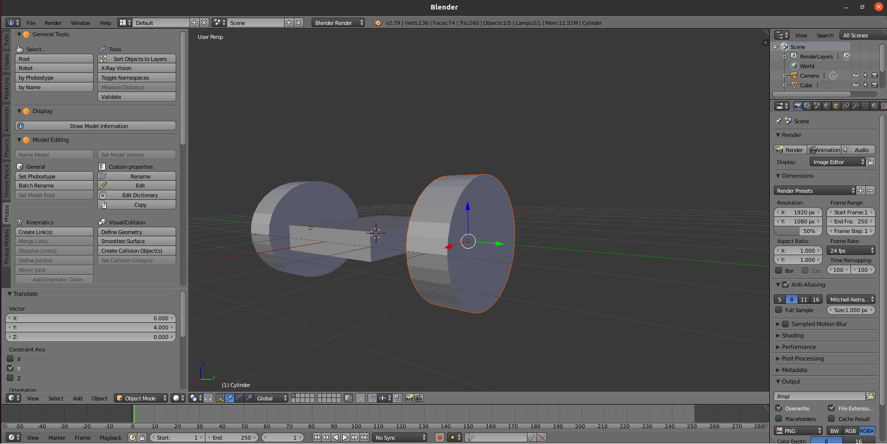

Now we convert our model to URDF, first we define the `<visual>` part.

Select every model part one at a time, `Set Phobostype` and set the type as `Visual`


Select every model part one at a time, `Define Geometry` and set the type as the right type. If the shape is not one of box, sphere, or cylinder, select `mesh`.

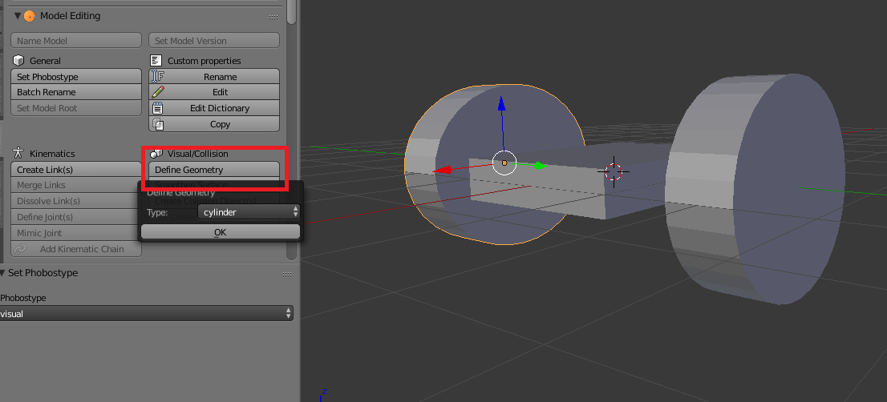

Now we define Parent-Child pairs for the parts of the model. For one of these pairs, **first select the 'child' part, and then select the 'parent' part**. Press `Ctrl-P` and `Set Parent To - Object`. Repeat until all parts are added.

> The combination of all links in a URDF must be a tree and there cannot be loops.


Now we define links. Select every part of the model one at a time, `Create Link(s)`. Notice the `Location` option below and `selected objects` is the recommended setting.


Now every part of the model should have a corresponding link. **First select the part, and then select its link we just created**, `Ctrl-P` and `Set Parent To - Bone Relative` until every part is binded with its link. (You can press `Z` to switch to wireframe view to select the link covered by the parts). **Notice: links are the octahedrons with a sphere on its head and parts are the model**. Be careful of their difference.


Now define Parent-Child pairs for links. **First select the 'child' link, and then select the 'parent' link**. `Ctrl-P`, and then `Set Parent To - Bone Relative`. Repeat until all links are added.

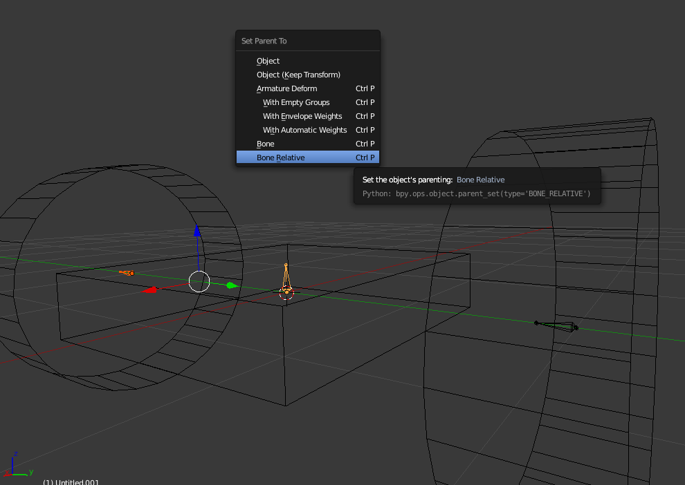

Now the `Outliner` on the top-right of Blender should look like this:


Change the name for future maintenance. In the final generated URDF, names of the `Amature` (the human shape) will be the names for the links; names of the mesh (upside-down triangle) will be names for the \<visual>. (\<visual> doesn't always need a name. So we usually don't name it when writing URDF by hand.)

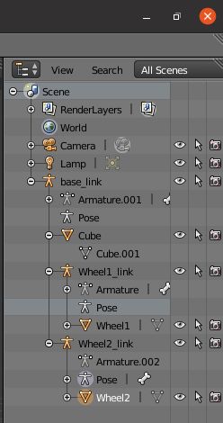

Select a pair of link (not parts). `Define Joint`. Different joints will change the shape of the links from octahedrons to other shapes.

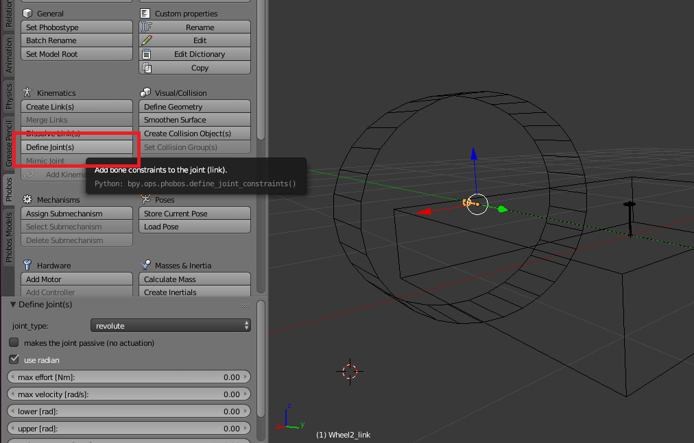

Note that when defining joints with a upper/lower limit like `revolute`. We need to set a non-zero upper & lower limit. Or it will be automatically converted to a `fixed` joint.


Next define the collision for the parts. Select a part of the model each time and `Create Collision Object(s)`.

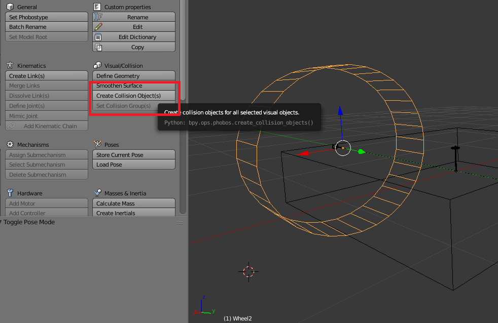

Now the `Outliner` on the top-right of Blender should look like this. Names of the newly added mesh (upside-down triangle) will be names for the \<collision>. (Same as \<visual>, \<collision> doesn't always need a name. So we usually don't name it when writing URDF by hand.)


Now select the only link without a parent link (base link). `Set Model Root` to set it to the root link of the URDF.

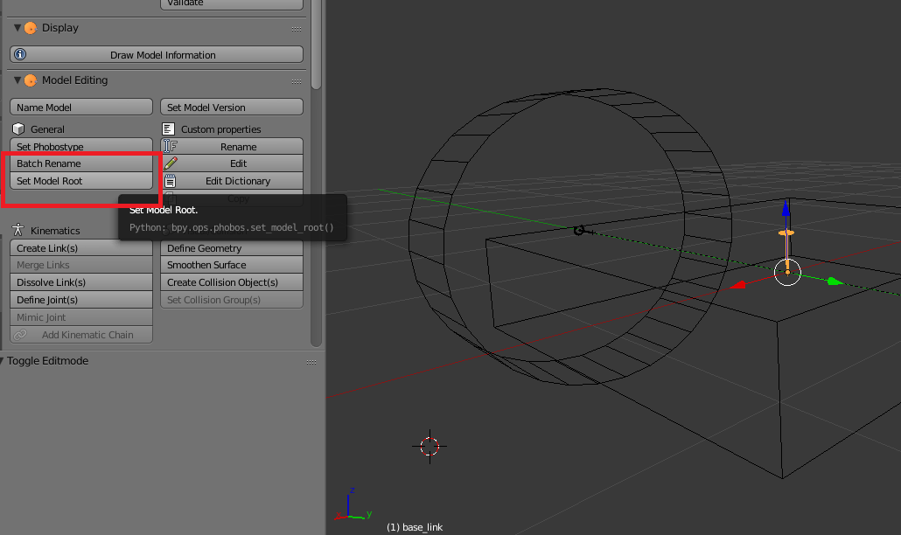

`Name Model` to name the URDF. After this step, the root link will change to the shape of a wrench.


Now we export the URDF. Press `A` twice to deselect all parts. Deselect `Selected only`, or only selected parts will be exported.

> Lgihts and Cameras will be ignored during the export so don't worry about them

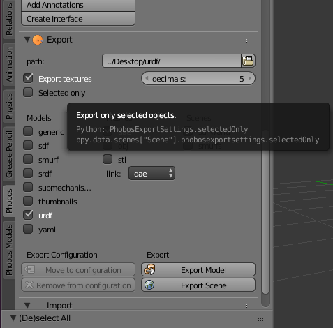

After setting up, export the model with `Export Model`. This model doesn't have Meshes to export so we can deselect the `dae` option. If there are meshes to export, dae is the recommended format.

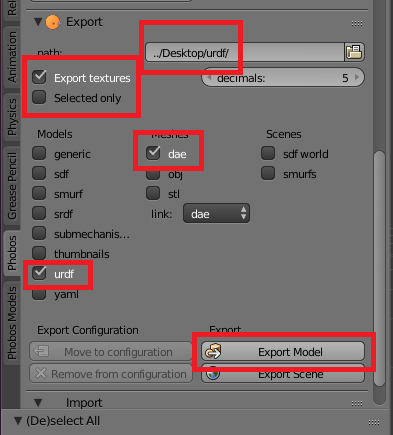

Now we should see 2 (or 1, if choose not to export Mesh) folders in the export directory

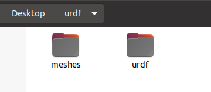

Finally we need to edit the generated URDF. The generated URDF joint's name will be the same as the link's by default, which will cause a error when loading into Gazebo. Change the name of the joints to others (for example, adding a _joint suffix).

Before (Above) After (Below)


Load the URDF into Gazebo as described in chapter 2.

> If a bug occurs, you can refer to <a href="#bug" target="_blank">Common Bug Fix</a> at the end of this guide.


#### <a id="mesh">How to make URDF with more details (mesh file)</a>


>**First understand if you need a detailed model or a texture !!**<br>
If you need<br>
Traffic Sign<br>
AprilTag<br>
Things only for CV module / human users to recognize in the simulation. Please, PLEASE consider using textures first.<br>
If misusing highly detailed models in places that should use textures, **performance and CV modules' accuracy will be largely reduced**. Besides that you waste lots of time trying to make detailed models.
If you need a texture, please see the next chapter <a href="#texture" target="_blank">How to make URDF with image texture (texture and material)</a>

When using Phobos `Define Geometry`, select the type as `mesh` and the exported URDF can be linked to the mesh files.

The first step is build a model with Blender. There are many Blender tutorials out there.

Although we can split this model into 3 Cylinders stacking together (3 links) in URDF, we import the entire model as one mesh to show how to import a mesh file.

**The difference between this and the last chapter is this model is 1 link in Gazebo but last chapter was 3 links connected together**


All the steps are the same as the last chapter except `Define Geometry`, we need to set the type as `mesh`.

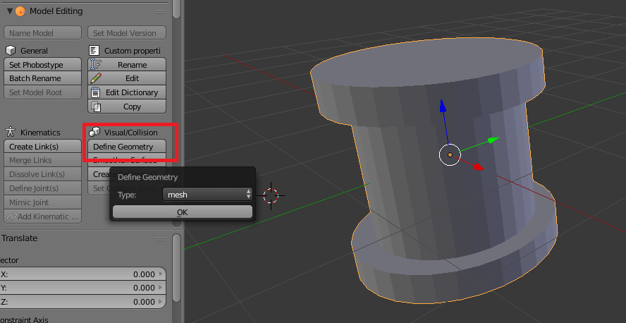

This is how it looks like after adding collisions. For optimizing the performance, we set its collision to a Cylinder (URDF native).

This is the Visual

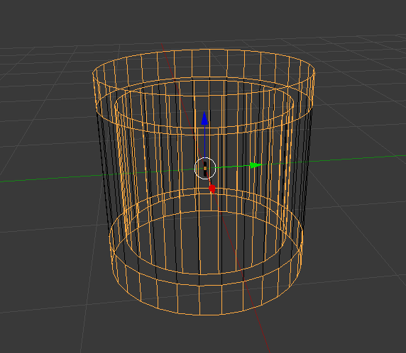

This is the Collision

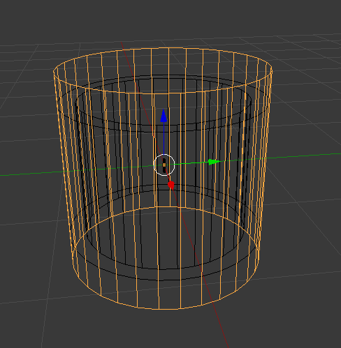

Import to Gazebo as described in chapter 2.

> URDF generated by Phobos uses relative directory. If using incorrectly, a model invisible bug might occur. See <a href="#bug" target="_blank">Common Bug Fix</a>


#### <a id="texture">How to make URDF with image texture (texture and material)</a>

In this chapter we will introduce how to use Blender to export Mesh files with textures. Textures is a big branch of Blender so sometimes it is hard to find the tutorial you need. So we summerize common methods of adding textures to Blender models here. Take adding AprilTags to a cube as an example.


*Blender Version: 3.0.0. The version doesn't matter but when I use 2.79b to export DAE, a model invisible bug sometimes occurs. Importing the model export from 2.79b to 3.0.0 and export it again fixes the bug. So use a newer version if you can*

We need 2 things for making a texture: The first thing is an image for texture (common image format, png/jpg/...). When adding a 2D image to a 3D model, we need to break the 3D model into flat faces. But we notice that adding the same image to a cube, we can find many ways to break down the cube and many ways to add the image: all 6 faces having the same image; only 1 face and the other 5 are empty; etc. So we need to tell the software how do we want the 2D image adding to the 3D model. This step is called **UV mapping**, which is the second thing we need.

All textures in Blender are described with Material. We first create a new material.

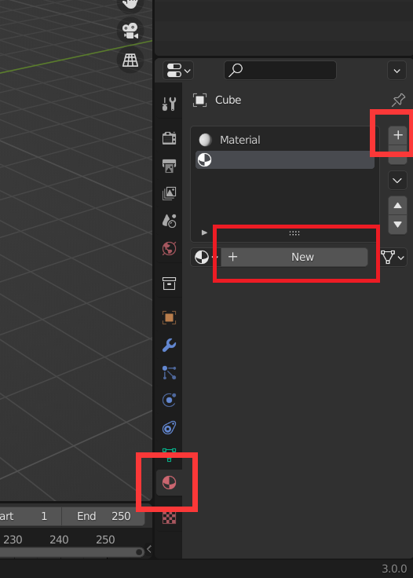

A texture must be a material, but a material is not always a texture. We need to set the material to a texture. Open the `Shading` panel. Here we can the shading of the material (how the material looks like under lights).


This is Blender's Shader Nodes. By default, Blender creates `Principled BSDF` and `Material Output` nodes. We press `Shift-A` to create a new node. Click `Search` and add an `Image Texture` node.


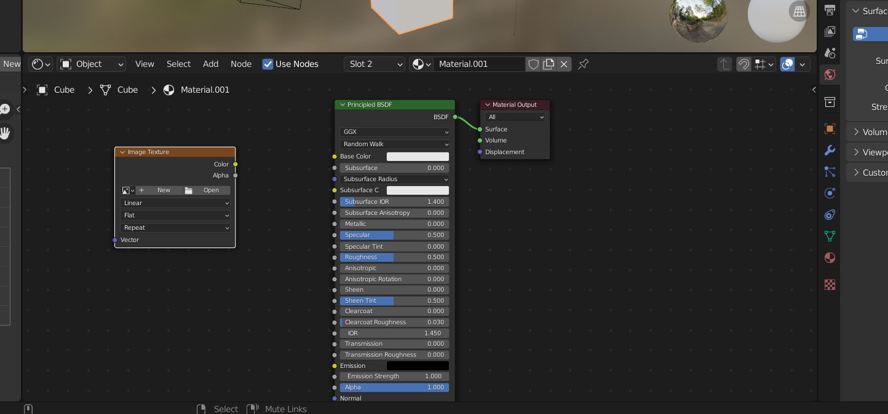

Select the image you want to make a texture in the `Image Texture` node (most image formats work). Then connect the `Image Texture`'s `Color` to `Principled BSDF`'s `Base Color`.

**Now we have the image. We can start to define how the image is added to the faces**

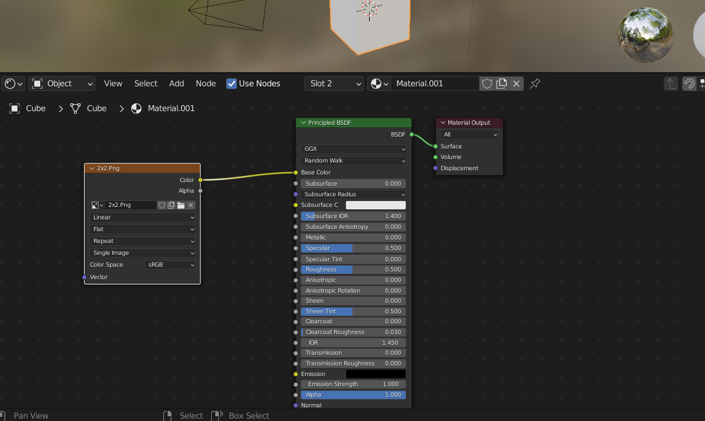

Open the `UV Editing` panel. Make sure you are in `Edit Mode`. Press `U` can UV Mapping (break down to 2D) your selected faces of the model. We usually select `unwrap`, but for cubes Blender has a `Cube projection` option. We choose it.

> Only selected faces will be unwrapped. Make sure you select all faces you need.


After UV mapping, make sure 2 things:

On the model side, make sure on the top left is the `Face Select` mode and on the top right `Viewport Shading` is the `Material Preview` mode.

> If you can't find anything on the top right, make its window larger.


On the `UV Editor` side, make sure on the top left is also the `Face Select` Model and on the top right you select the image we want. You should see the image in the UV Editor.

Click material with the `Image Texture` we created during the last step on the right side. Select faces of the model that need textures, click `Assign`.

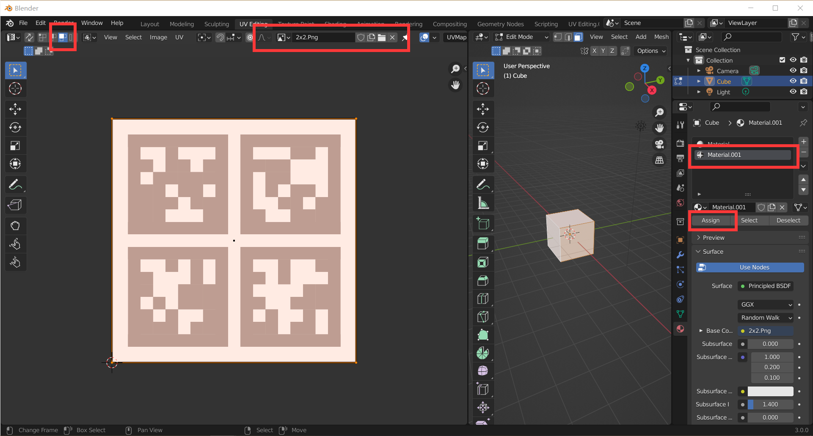

Now the textures are mapped to the selected faces.


Select faces that don't need textures, `Assign` the default material. Then we get a model with textures only adding to part of the faces.

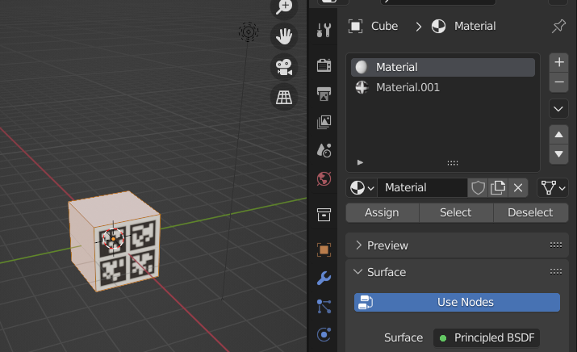

To adjust the texture on a face, select the face's wireframe in UV Editor on the left. Press `G` to move and press `S` to scale. All other shortkeys are the same as editing the models.

Now we can `File -> Export` to export.

**Difference between DAE STL OBJ**

A texture is always an independent image from the mesh file. As we discussed in the first chapter, *What formats of model does Gazebo need*, Gazebo supports 3 formats of mesh files: **DAE, STL, OBJ**. Every foramt has a different way to deal with image textures.

DAE (lawful good) - When exporting, the image texture will be exported to the same directory. DAE uses relative directory to use the texture image. As long as the texture image and the DAE file is in the same directory, the texture won't fail.


OBJ (true neutral) - When exporting, OBJ generates a UV file (how the image is added to the faces) and a Mesh file (3D model without any textures). OBJ files generated from Blender uses a absolute directory to use the original image opened in Blender. If the original image changes directory, texture will not be loaded. But you can edit the .mtl file to change the directory to a relative directory.

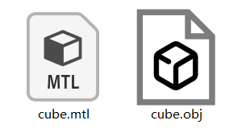

STL (chaotic evil) - STL doesn't support textures at all.

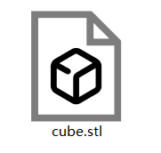

Now you may understand why **DAE** is the recommended format by Gazebo.

**Extra Problem: Scaling of the model**

When scaling the model, textures already added to the model will remain the same. What if I want the texture doesn't change?


`Object -> Apply -> Scale` to apply the scaling.

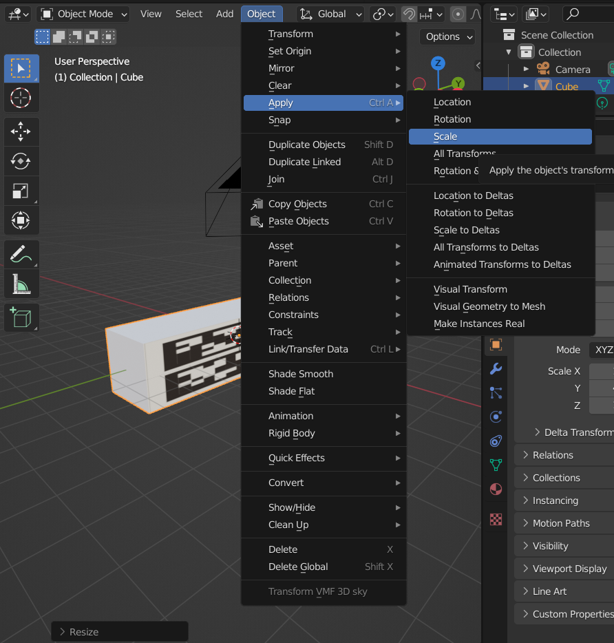

Enter `Edit Mode`. Press `U` to do the UV mapping again.

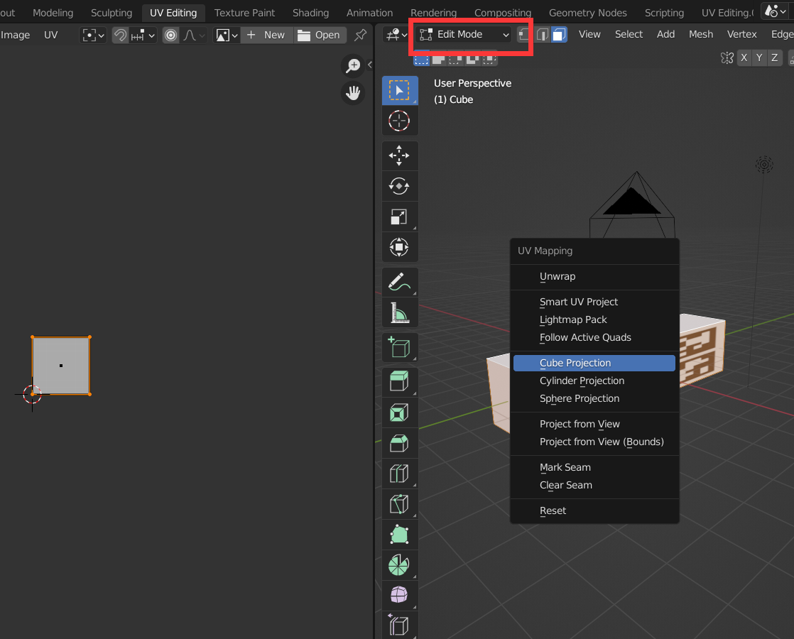


Done. If you don't want the texture to repeat in places not defined, you can find the `Image texture` node in the `Shading` panel to change the setting.


#### How to control the speed and position of a URDF in Gazebo (Gazebo Plugin)

To control a URDF in Gazebo, we need to use Gazebo Plugin. Take a sphere as an example:

```
<?xml version="1.0"?>
<robot name="ball">
  <link name="ball_link">=
    ... <!-- content of the link -->
  </link>

  <gazebo>
   <plugin name="object_controller" filename="libgazebo_ros_planar_move.so">
     <commandTopic>/ball/cmd_vel</commandTopic>
     <odometryTopic>odom</odometryTopic>
     <odometryFrame>odom</odometryFrame>
     <odometryRate>20.0</odometryRate>
     <robotBaseFrame>ball_link</robotBaseFrame>
   </plugin>
 </gazebo>

</robot>
```

Defined in the `<plugin>` tags are the Gazebo plugins. Gazebo has many native plugins. Here's an official tutorial about them: https://classic.gazebosim.org/tutorials?tut=ros_gzplugins I think this is a very detailed tutorial. So here we only take (my most used) planar move plugin as an example.

Load the sphere into Gazebo. Then use:
```
rqt_graph
```
to check the connection of all nodes.


Now sending commands to `ball/cmd_vel` to control the velocity of the sphere.

Control with the console as follows. Note that all contents after the topic name (here is `/ball/cmd_vel`) can auto-fill with `Tab`.

```
rostopic pub /ball/cmd_vel geometry_msgs/Twist "linear:
  x: 0.0
  y: 0.0
  z: 0.0
angular:
  x: 0.0
  y: 0.0
  z: 0.0"
```

If we want to control with scripts/codes, simply wrap it with roscpp or rospy.

Notice: The velocity is added to the local coordinates of the model. When using this plugin on a sphere, the sphere may roll on the ground, cause a change in orientation of the coordinates, and move in a weird way. To check if this is the bug, we can switch to `Move Model` mode and click on the model. Then we can see the orientation of its local coordinates.

To avoid this bug, my personal workaround is to disable the gravity of the sphere and spawn the ball above the ground.

**To control the position of the model, we need the rosservice of Gazebo `/gazebo/set_model_state`. This is the service where physics is ignored.**


#### How to rotate a joint of a URDF in Gazebo (ROS Moveit!)

If you have a URDF that has links and joints defined and you want to control the motion of the joints with code, you need to bind `<transmission>` for joints you want to control.

```
<transmission name="tran1">
  <type>transmission_interface/SimpleTransmission</type>
  <joint name="yaw_joint">
    <hardwareInterface>hardware_interface/PositionJointInterface</hardwareInterface>
  </joint>
  <actuator name="yaw_motor">
    <hardwareInterface>hardware_interface/PositionJointInterface</hardwareInterface>
    <mechanicalReduction>1</mechanicalReduction>
  </actuator>
</transmission>
```
`joint name` needs to be the same as the joint you want to control. Names of the actuator and transmission does not matter.

Notice `<hardwareInterface>`. This is a very important tag. In ROS noetic, it is usually set to one of the two:<br>
`hardware_interface/PositionJointInterface`<br>
`hardware_interface/EffortJointInterface`

**How to find which hardwareInterface you need:**

If your model doesn't need to push/drag/grasp anything, choose `PositionJointInterface` can save your time from adjusting PID.

If your model needs to interact with objects with force (pushing objects on the ground doesn't count), you need to choose `EffortJointInterface`, or your model cannot apply any force in the simulation.

> If console reports there is no one of these hardwareInterface when spawn_model: these hardwareInterface can be installed like all the other ROS packages (apt install).

After defining `<transmission>`, we can use the Moveit! Setup Assistant to config the robot's motion control.

For this step you can look at the Moveit!'s official tutorial: https://ros-planning.github.io/moveit_tutorials/doc/setup_assistant/setup_assistant_tutorial.html

The command to open the Moveit! Setup Assistant is:

```
roslaunch moveit_setup_assistant setup_assistant.launch
```

After the configuration, use

```
roslaunch <your_export_dir> demo_gazebo.launch
```
to start controlling.

Moveit also provides this tutorial: https://ros-planning.github.io/moveit_tutorials/doc/gazebo_simulation/gazebo_simulation.html to help its users to learn Gazebo + Moveit. If launching `demo_gazebo.launch` fails, you can debug with this tutorial.

To control with Python / CPP, you can look at another official tutorial from Moveit!: https://ros-planning.github.io/moveit_tutorials/doc/move_group_python_interface/move_group_python_interface_tutorial.html


#### How to make a simulated camera and simulated sensors (Gazebo Plugin)

https://classic.gazebosim.org/tutorials?tut=ros_gzplugins

Force sensor, camera, and other sensors' tutorial


#### Possible contents in the future

- How to grasp and lift: an example with Universal Robot
- How to use human models in Gazebo

#### <a id="bug">Common Bug Fix</a>

###### 1. `process has died` when launching, but last time it worked
Gazebo doesn't allow open multiple Gazebo at the same time. All users on one PC can only open one Gazebo at a time.

```
[gazebo-1] process has died [pid xxxxx, exit code 255
```
This might be Gazebo not shut down completely last time exiting. Use

```
killall gzclient
killall gzserver
```
to shut down Gazebo completely.

###### 2. Invisible Model

First turn on collision visible to make sure the model is invisible, but not they are not loaded.


If you can only see the collision of the models but can't see their mesh, this is model invisible. If the model is not loaded, check the console you opened Gazebo and you will likely find some error messages. Here we only talk about debugging the invisible model bug.

The invisible bug usually because of 2 possible reasons

**First, if mesh in URDF uses a relative path, instead of the name of the ROS package, then, this relative path use where you run `rosrun gazebo_ros gazebo` as the starting point!**

For example, for the following file structure<br>
/model<br>
|--/mesh<br>
|--/urdf<br>
Suppose we have a URDF in `/urdf` that uses `../mesh/a.dae` in its `<mesh>` tag for its mesh file's directory, if we launch `rosrun gazebo_ros gazebo` in `/model`, Gazebo will look for `/mesh/a.dae` in the upper directory of `/model`, and the model will be invisible because there is no such model.


**Second, if use DAE exported from Phobos:**

There is a chance that DAE exported from a old version Blender cannot be displayed in Gazebo

Import the DAE to a new version of Blender and export can solve this bug. I only met this bug once and the reason is unclear.

###### 3. Cannot load `.world` file made by others

Check if the file has `world time stamp` tag and delete it. This bug will cause only the creator can use the saved world file.

###### 4. Broken model

Sometimes we need to fix some broken models that cannot be recognized by Gazebo. Some simple methods as follows:

One of the common breaks is model has a Normal facing the wrong direction. For a 3D model, each face has a facing direction. If the direction is wrong, Gazebo may reports an error. We fix the model with Blender:

First open the display for `Face Orientation`, the direction of each face will be marked with red and blue.


We can see one face of the model (red) is facing the opposite direction to the other directions. We select this face in `Edit Mode` and flip the normal.


Another common breaks is the model is not closed. Some of the faces is missing:


Select the edges of the missing face, press `F` to fill the face. If the face is curvy or has many edges, use `Alt - F` and we can fill this face with triangles.
